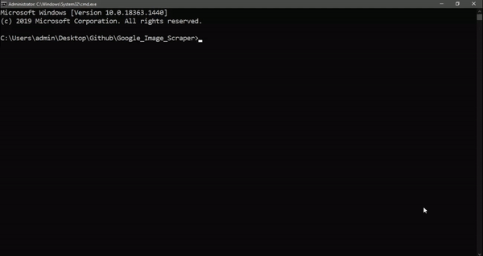

# Image_Scraper
#### Scrape images from 'Google Images' webpage

*Note: It is advised to use this image scraper for learning/research purposes only.*

## Features
1. A file containing a list of keywords can be given to the program
1. A log file is created to find and remove bugs if any
1. Coloured text output so it is easier to find relevant information quickly
1. A new directory is created for every keyword

## Demo: Scraping 10 cat images

## How to use?
Please read the [manual](https://rutuparn.medium.com/9cf9a5950594?source=friends_link&sk=7e353dd0ffe00a765d97fd508656fc61)

## Alternate approach: Google Colab
1. Upload the colab.ipynb onto Colab
1. Change the path to the directory where you want to store the images
1. Change the keyword. Use iterations in case of multiple keywords. 
1. Run the notebook

### Made with lots of ⏱️, 📚 and ☕ by InputBlackBoxOutput
